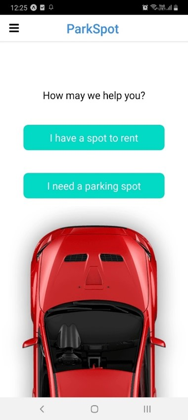
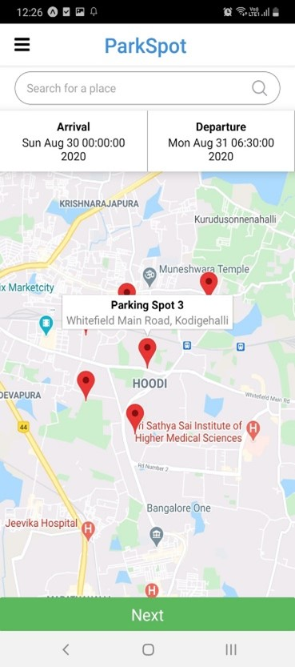
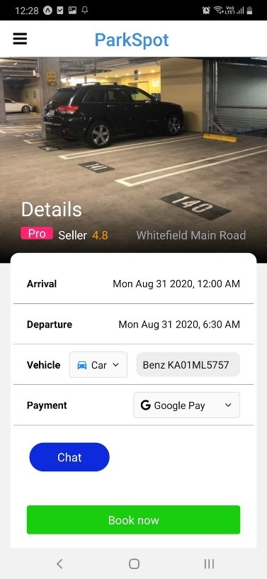
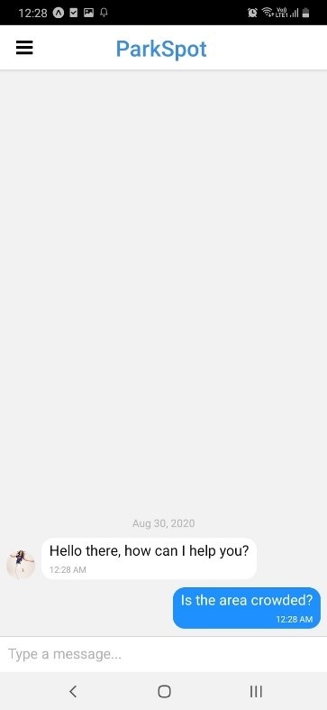
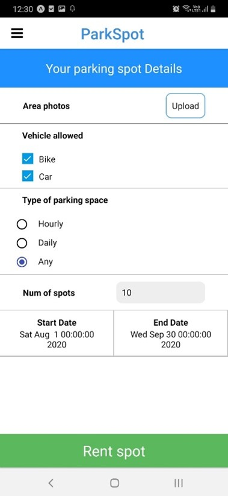
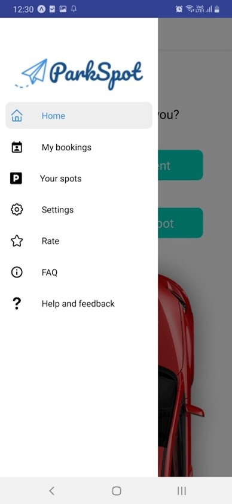
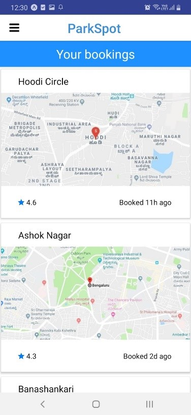
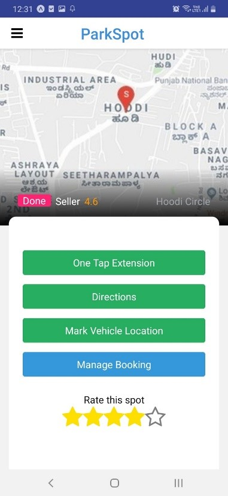

# ParkSpot
A parking spot renting and booking cross-platform app.

ParkSpot

## Team:
Sahith Kurapati
Sreyans Bothra
Siddharth K Rao
Navneeth S Holla

Finding parking spaces in India has become a phenomenal problem with
the increasing number of vehicles each day. We have chosen to solve this problem by making a private space -parking and renting application.

## Solution:
Mobile/web app where landowners who have extra parking spots can
very easily rent them out in just a few clicks.
Users who require parking space for their vehicles (bikes, cars, scooters, etc.) can easily book a spot through the app on an hourly/daily basis.

## Our Target Customers:
Renters: Who would want to give their spots for parking.
Rentees: People who would want to park their vehicles.
The primary demographic are adults between ages 18-60 owning a vehicle or land.

## Competition and Barrier to Entry:
Currently, existing solutions do not solve the entire problem we are solving. (Renting out private space)
As we are among the first to implement it in India, we don't have any competitors at the moment.
It would not be so easy to replicate our solution as we have a strong business plan with good customer service. We are focusing on profitability- something which many startups/companies fail to focus on.

## Marketing Model:
Social Media ads and promotions with accounts on all platforms. (Google, Instagram, Twitter, Facebook, etc.)
Radio ads because many car owners tend to use radio a lot.
Youtube sponsorships for a vehicle promoting channel/ city exploration channels.
SEO to drive organic traffic to the website.

## Revenue Model:
Commission from both renters and rentees, we can charge 10-20% of the value per transaction.
A range of Premium options for rentees with a subscription-based model. (Monthly/Yearly)
Display Ads.
Cash burn would be server maintenance, marketing, and customer service.

## Unique Selling Point:
Users can book any spot or even rent out their spot.
Pricing can be adjusted according to surge and traffic density using Machine Learning.
A chat with the renter/chat-bot feature to clarify all doubts relating to the parking space before renting for happier customer satisfaction.
Prepay and postpay options with multiple payment options for customer flexibility and trust.

## Future Plans:
1-year plan:
o Make the application accessible and making it popular.
o Longtime parking options.
o Sharing your parking location with your friends and family.
o On the spot scan and book options.
3-year plan:
o Make various government and unused land come under the scheme to enhance our landbank.
o Provide a host of services like Pollution Certificates, Vehicle
Insurances, Vehicle Maintenance and basically become a one pit
stop for all vehicle needs.

5-year plan:
o Expand from Bangalore to all over India.
o Buying our own parking spots so that we don’t have to pay the
renters and we will also be able to scale up and provide more
properties up for parking.

## ParkSpot App Images

